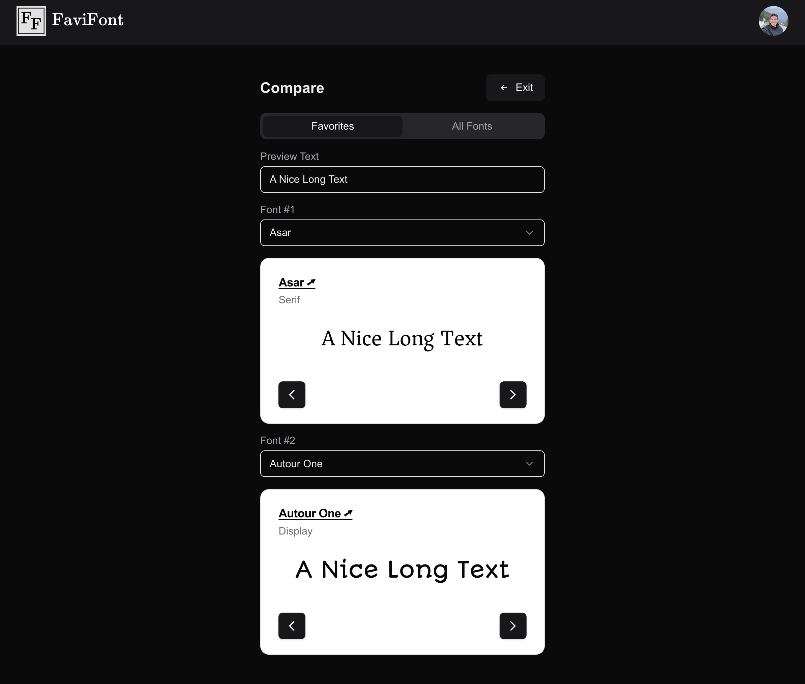

# [ FaviFont](https://favifont.jacksontaylor.com)

FaviFont is a simple web tool to help designers and developers choose the best font with their project with powerful discovery and comparison functionality.

Try it now! [Click here.](https://favifont.jacksontaylor.com)

## Explore

The explore page provides a unique experience for discovering and saving your favorite fonts.

## Compare

The compare feature is a powerful tool for visualizing fonts side by side and making the final decision.

